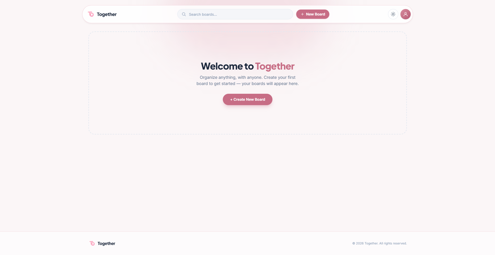
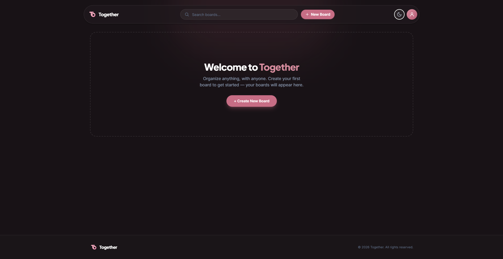

<div align="center">


# Together

### A Trello-style kanban board — organize anything, with anyone.

Create boards, build lists, and drag cards around — wrapped in a soft pastel theme
with light & dark modes. Everything is saved right in your browser; no sign-up, no backend.

<br/>


</div>

---

## 📸 Screenshots

| ☀️ Light mode | 🌙 Dark mode |
| :---: | :---: |
|  |  |

---

## ✨ Features

| | |
| --- | --- |
| 🗂️ **Boards** | Create, rename, edit, and delete |
| 🖼️ **Custom backgrounds** | Pick a gradient or upload your own image (auto-resized & compressed) |
| 📋 **Lists & cards** | Add lists, rename them inline, add cards Trello-style |
| 🎨 **Color-coded cards** | A left stripe in any of 7 colors |
| 🖱️ **Drag & drop** | Reorder cards or move them between lists |
| 🌗 **Light / Dark mode** | One-tap toggle, defaults to light, remembers your choice |
| 🔎 **Search** | Filter boards from a sticky navbar that shrinks on scroll |
| 💾 **Offline-first** | All data lives in `localStorage` |

---

## 🧰 Built With

| Layer | Technology |
| --- | --- |
| **Language** | JavaScript (ES2022) + JSX |
| **UI Library** | [React 18](https://react.dev/) |
| **Build Tool** | [Vite 6](https://vitejs.dev/) |
| **Styling** | [Tailwind CSS v4](https://tailwindcss.com/) — class-based dark mode |
| **State** | React `useReducer` + Context API |
| **Persistence** | Browser `localStorage` |
| **Fonts** | Plus Jakarta Sans (display) · Inter (body) |

---

## 🎨 Theme & Colors

A soft **pastel-pink** identity over a deep **plum** dark mode.

**Brand — pastel rose / pink**

| `brand-50` | `brand-200` | `brand-400` | `brand-600` | `brand-700` | `brand-900` |
| :---: | :---: | :---: | :---: | :---: | :---: |
| `#fbedf0` | `#f1ccd5` | `#d88d9f` | `#c76d85` | `#b65c76` | `#4a2634` |

**Surfaces**

| Mode | Background | Surface |
| --- | --- | --- |
| ☀️ **Light** | `#fbf6f7` warm off-white | white + pink borders |
| 🌙 **Dark** | `#181216` plum-900 | `#2a2026` → `#352a31` plum |

> Defaults to **light mode** on first load, then remembers whatever you switch to.

---

## 🚀 Getting Started

```bash
git clone https://github.com/relixta/Together-Project-TrelloClone.git
cd Together-Project-TrelloClone
npm install
npm run dev      # http://localhost:5173
```

| Script | What it does |
| --- | --- |
| `npm run dev` | Start the dev server with hot reload |
| `npm run build` | Build for production into `dist/` |
| `npm run preview` | Preview the production build locally |

---

## 🧩 How It Works

State flows one way: components read from context and dispatch actions; the reducer
updates the store, which auto-saves to `localStorage` and re-renders the UI.

```
   ThemeProvider ── BoardProvider ─────────────────┐
                         │  state + dispatch        │ auto-save
                         ▼                          ▼
            App ──► BoardSection ──► BoardCard   localStorage
             │                                       ▲
             └──► BoardView ──► List ──► Card ────────┘
                  (DnDProvider handles card drag & drop)
```

No component holds its own data — everything reads and writes through `useBoards()`.

---

## 📁 Project Structure

```
src/
├─ App.jsx                Root — switches between home & board views
├─ main.jsx              Entry — wraps Theme & Board providers
├─ index.css             Tailwind theme tokens (pastel-pink + plum)
├─ context/
│  ├─ BoardContext.jsx   useReducer store (boards/lists/cards) + localStorage
│  ├─ ThemeContext.jsx   Light / Dark theme state
│  └─ DnDContext.jsx     Card drag-and-drop state
├─ components/
│  ├─ Navbar.jsx         Sticky navbar (home & board variants)
│  ├─ BoardSection.jsx   "Latest View" / "All Board" grids
│  ├─ BoardCard.jsx      A board tile (open · edit · delete)
│  ├─ BoardFormModal.jsx Create & edit board (name · color · image)
│  ├─ BoardView.jsx      In-board page: lists row + full background
│  ├─ List.jsx           A list column (rename · add card · drop target)
│  ├─ Card.jsx           A card (rename · recolor · delete · draggable)
│  ├─ ConfirmDialog.jsx  Reusable destructive-action confirmation
│  ├─ Footer.jsx
│  └─ icons.jsx          Inline SVG icon set
└─ lib/
   ├─ backgrounds.js     Board gradient presets
   ├─ cardColors.js      Card stripe palette
   └─ image.js           Image resize / compress helper
```

---

## 📝 Notes & Limitations

- Data is stored per-browser in `localStorage` — real-time sharing/collaboration would need a backend.
- Drag-and-drop uses the native HTML5 API (mouse/desktop); touch dragging isn't supported yet.

---

<div align="center">

Made with 🩷 — relixta_

</div>
